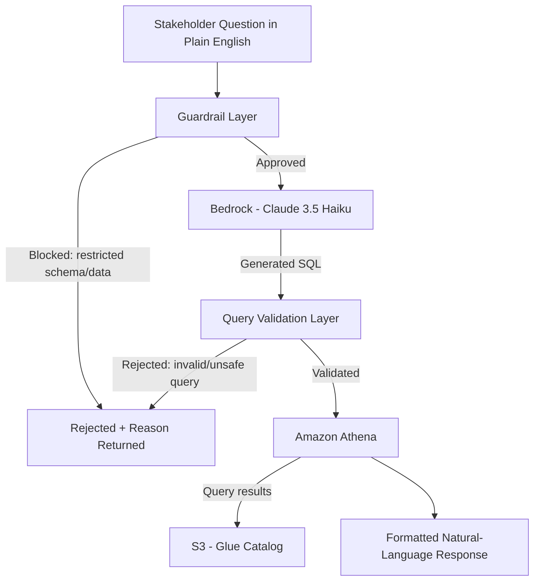

# Case Study 1: Enterprise Natural Language Query (NLQ) Engine
### Letting Non-Technical Stakeholders Query a Data Lake in Plain English

**Stack:** AWS Bedrock (Claude 3.5 Haiku) · AWS Glue · Amazon Athena · Amazon S3

---

## TL;DR

Auditors and investor-facing teams needed answers out of a multi-terabyte S3 data lake — but every answer required someone who could write SQL and understood the schema. I built a natural-language query engine that lets non-technical stakeholders ask a question in plain English and get back a validated, guardrailed result, without ever touching a query editor or a data engineer's calendar.

**The outcome:** audit and investor data requests that used to require a data engineer as a middleman became self-serve — safely.

---

## The Problem

The organization's analytical data lived in S3, cataloged through **AWS Glue** and queried via **Amazon Athena** — a solid setup for engineers, but a wall for everyone else. Two recurring groups kept hitting that wall hardest:

- **Audit teams**, who needed ad-hoc, defensible answers pulled directly from source data on tight timelines.
- **Investor-facing teams**, preparing pitch and diligence materials who needed numbers on demand, not a week later once a query got queued behind other engineering work.

Every one of these requests turned into a bottleneck: business users writing tickets, engineers translating "how many X happened last quarter" into SQL against Glue-cataloged tables, and both sides burning time.

**The mandate:** build a system where those users could ask questions directly — without giving them raw, unguarded access to Athena, and without a model free to invent numbers on high-stakes audit and investor data.

---

## Architecture

**Flow, in plain terms:**

1. A stakeholder asks a question in plain English — no SQL, no schema knowledge required.
2. A **guardrail layer** runs first, before any query is even generated. It checks: is this question touching a restricted or confidential schema? Is this user permitted to see this class of data at all? Bad requests get rejected here, before they ever reach a data source.
3. Approved questions go to **Claude 3.5 Haiku on Bedrock**, which translates the natural-language question into SQL against the known Glue-cataloged schema.
4. A **query validation layer** checks the generated SQL before execution — catching malformed queries, disallowed operations, and referencing of columns/tables that don't actually exist.
5. Validated queries run against **Athena**, over data cataloged in **Glue**, sourced from **S3**.
6. Results are translated back into a plain-language response, not a raw result table dump.

The two-gate design (guardrails *before* generation, validation *after* generation) is deliberate: it stops unauthorized access attempts before they cost a model call, and it stops hallucinated or malformed SQL before it ever touches production data.

---

## Key Design Decisions

| Decision | Why |
|---|---|
| **Guardrails before query generation, not after** | Cheaper and safer to reject an out-of-bounds question upfront than to generate a query and validate it after the fact. |
| **Claude 3.5 Haiku over a larger model** | Query translation over a known, cataloged schema is a well-bounded task — Haiku's latency and cost profile fit a high-frequency, self-serve tool far better than a heavier model. |
| **Separate query validation layer (not just prompting)** | LLM-generated SQL can hallucinate columns or tables that don't exist. A deterministic validation pass against the actual Glue catalog schema closes that gap — the model doesn't get the final say on what runs. |
| **Athena + Glue over a live database** | The data lake was already S3-native; Athena gives serverless, pay-per-query access without standing up or maintaining a database layer. |
| **Stakeholder schema-naming training** | Coached non-technical users to reference Glue-defined table/column names where possible in their questions — a small habit that measurably reduced ambiguity and hallucinated-field errors downstream. |

---

## What Made This Hard

- **Schema complexity.** A data lake catalogued across many Glue tables means a lot of surface area for the model to get wrong — picking the right table, the right join, the right column name.
- **Ambiguous phrasing.** Business questions like "how did Q3 look" don't map cleanly to a single metric or table — the engine needed conventions for resolving ambiguity rather than guessing silently.
- **Hallucinated columns.** Like any LLM-driven SQL generation, the model would occasionally reference plausible-sounding but nonexistent fields — this is exactly what the validation layer exists to catch before execution.
- **Security and permissions.** Audit and investor data is inherently sensitive — the guardrail layer had to reliably distinguish "this user can ask about this" from "this user cannot," before a query ever got built.

---

## Why This Matters for Your Stack

If your team has a data lake and a growing queue of "can someone just pull me this number" requests from non-technical stakeholders, this is the exact shape of problem this pattern solves — self-serve access with the guardrails and validation layer doing the job a human reviewer would otherwise have to do manually.
