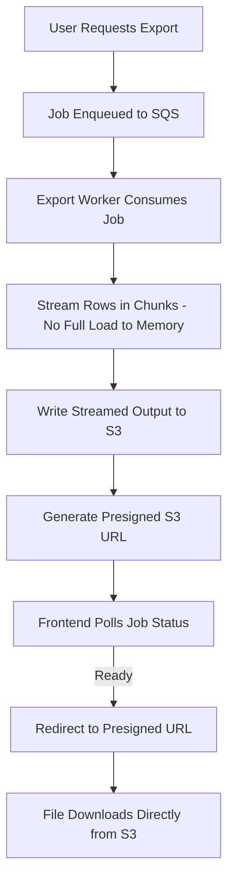

# Case Study 2: Async Export Pipeline for Large Datasets
### From 100% Failure Rate on Large Exports to Reliable, Streamed Delivery

**Stack:** Amazon SQS · Amazon S3 · Presigned URLs · Streaming I/O (CSV/Excel)

---

## TL;DR

Users exporting large datasets — 200K to 2 million rows — were hitting a **100% failure rate**. Every one of those exports timed out or crashed the request thread, because the system was trying to build the entire file synchronously, in memory, inside a single HTTP request. I redesigned the export path to be fully asynchronous and stream-based: the job gets queued, the file gets built without ever loading the full dataset into memory, and the user gets a presigned S3 link the moment it's ready.

**The outcome:** large exports went from *never succeeding* to a reliable, resumable, self-service download.

---

## The Problem

The existing export feature worked fine for small datasets — a few thousand rows, generated and returned within a single request. But it fell apart completely as row counts grew:

- **Synchronous generation** meant the export was built entirely within the lifetime of a single HTTP request — and large exports simply outran the request timeout.
- **In-memory file construction** meant the entire dataset — rows, formatting, everything — had to fit in memory before a single byte was written out. At 1-2 million rows, that's exactly the kind of memory pressure that crashes a service instance.
- **No retry path.** If anything failed partway through, the user got a generic error and had to start over from zero, with no visibility into why.

The net result: **every export above roughly 200K rows failed, 100% of the time.** This wasn't a degraded-performance problem — it was a completely broken feature for exactly the users who needed it most (the ones with enough data to actually need an export).

---

## Architecture

**Flow, in plain terms:**

1. The user requests an export. Instead of building the file inline, the request just creates a **job ID** and pushes it onto an **SQS queue** — the HTTP request returns almost immediately.
2. A worker process consumes the job off the queue and starts generating the export.
3. Rows are **streamed in chunks** — read, formatted, and written progressively — so the full dataset is never held in memory at once. This is what makes 1-2 million row exports actually survivable.
4. The streamed output is written directly to **S3** as it's generated, rather than assembled locally and uploaded as one final blob.
5. Once the file is complete, a **presigned S3 URL** is generated and attached to the job's status.
6. The frontend **polls the job status** using the job ID. Once the job reports "ready," the user is redirected straight to the presigned URL, and the download happens directly from S3 — never proxied back through the application layer.

---

## Key Design Decisions

| Decision | Why |
|---|---|
| **SQS-based job queue instead of synchronous request handling** | Decouples "the user asked for an export" from "the export is done," eliminating the request-timeout failure mode entirely. |
| **Streaming generation instead of in-memory construction** | The root cause of the original failures — this alone is what makes 1-2 million row exports possible without exhausting memory. |
| **Polling + presigned URL instead of pushing the file back through the app server** | Keeps large file transfer off the application layer entirely — S3 serves the download directly, at S3's throughput, not the app's. |
| **Job status as the single source of truth** | The frontend never needs to guess — it polls one job record and gets a clear "pending / processing / ready / failed" state. |

---

## What Made This Hard

- **Streaming without loading into memory.** Reworking export generation to be truly streaming — row by row or in bounded chunks — rather than "build the whole thing then write it," end to end, including for formats like Excel that aren't naturally stream-friendly the way CSV is.
- **Retry and failure handling.** A 2-million-row job failing at row 1.8 million needed a clear failure state and a retry path, not a silent hang or a generic 500 error.
- **Consistency between CSV and Excel outputs.** Excel's structured format (styles, sheets, cell types) makes true streaming harder than flat CSV — the pipeline had to handle both without regressing one to support the other.

---

## Why This Matters for Your Stack

If your product has a "download my data" feature that quietly falls over the moment a power user's dataset gets big, this is precisely the failure mode this pattern fixes — and it does so without adding new infrastructure the team has to babysit; SQS and S3 are both fully managed.
