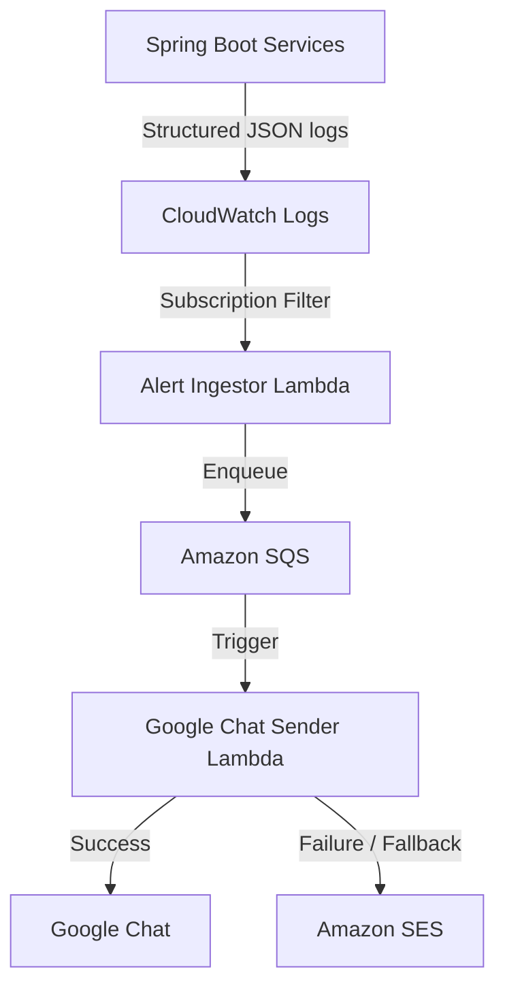

# Case Study 3: Production Observability Platform
### Designing a Fault-Tolerant, Event-Driven Alerting System on AWS

**Stack:** Spring Boot · AWS CloudWatch · AWS Lambda · Amazon SQS · AWS Secrets Manager · Amazon SES · Google Chat API

---

## TL;DR

Microservices in production generate thousands of log lines an hour — and buried in that noise are the two or three lines that actually matter. I designed and shipped a serverless, event-driven alerting pipeline that pulls critical failures out of CloudWatch in near real-time and pushes them straight into the on-call team's Google Chat, with automated email fallback so an alert never silently dies.

**The outcome:** engineers stop tailing logs to find out something broke. They find out the moment it breaks — in the tool they're already watching.

---

## The Problem

The system was built on a distributed Spring Boot microservices architecture. That's great for scalability, but it comes with a well-known tax: **log volume explodes, and signal gets lost in noise.**

There was no centralized way to know when something business-critical failed — a payment step, an integration call, a downstream dependency timing out — until someone happened to notice, usually after a user complained. There was no standing platform for:

- Capturing critical failures the moment they happen
- Routing them to the right humans, in the tool they already live in
- Guaranteeing delivery even if the primary notification channel is down

**The mandate:** build a centralized, event-driven alerting platform for application and infrastructure events — real-time, reliable, and cheap to run.

---

## Architecture

The system is fully serverless and event-driven end to end, which means no servers to patch, no polling, and cost that scales to zero when nothing's broken.



**Flow, in plain terms:**

1. Spring Boot services emit structured JSON logs for business-critical events.
2. A **CloudWatch Subscription Filter** watches for those log patterns in near real-time and forwards matches — no polling delay.
3. An **Alert Ingestor Lambda** parses the log event and drops it onto an **SQS queue**.
4. SQS decouples ingestion from delivery, giving the pipeline built-in retries and buffering if the notification channel is briefly unavailable.
5. A **Google Chat Sender Lambda** consumes the queue, formats the event into a Google Chat card, and delivers it.
6. If Google Chat delivery fails for any reason, the pipeline **automatically falls back to Amazon SES** — so a notification failure never means a *silent* failure.

---

## Key Design Decisions

| Decision | Why |
|---|---|
| **CloudWatch Subscription Filters** over polling | Near real-time delivery — alerts fire as events happen, not on a cron cycle. |
| **Lambda for compute** | Fully serverless: zero idle cost, scales automatically with log volume. |
| **SQS as a buffer layer** | Decouples ingestion from delivery. If the Chat API is briefly down, messages queue and retry instead of getting dropped. |
| **Secrets Manager for webhook URLs** | No credentials or webhook secrets hardcoded anywhere in source or environment files. |
| **SES as a fallback channel** | Guarantees delivery resilience — if the primary channel fails, the alert still reaches someone. |

---

## Structured Logging

Every business-critical failure emits a structured JSON log rather than a free-text message, so it can be reliably parsed downstream without brittle regex matching:

```json
{
  "priority": "HIGH",
  "event_type": "PAYMENT_GATEWAY_TIMEOUT",
  "service": "payments-service",
  "transaction_id": "txn_8834ff21",
  "failure_code": "GATEWAY_504",
  "timestamp": "2026-06-30T14:12:03Z",
  "notify_admin": true
}
```

This structured contract is what makes the whole pipeline reliable — the Ingestor Lambda doesn't guess what happened, it reads it directly off the event.

---

## Security

- **Least-privilege IAM** — each Lambda has access to exactly the resources it needs, nothing broader.
- **Secrets Manager** for all webhook URLs and credentials — nothing hardcoded, nothing checked into source.
- **Environment isolation** between staging and production alerting pipelines.
- Zero credentials in code, config files, or environment variables committed to version control.

---

## Testing & Validation

Before shipping, the pipeline was validated end-to-end:

- Application-level alert triggers fire correctly on structured log matches
- SQS queueing, retry, and dead-letter behavior under load
- Lambda IAM permissions scoped correctly (fail-closed, not fail-open)
- Google Chat card delivery and formatting
- SES fallback triggers correctly when the primary channel fails
- Admin-facing hyperlinks in alerts route to the correct internal dashboards
- Full production deployment and smoke test

---

## Future Improvements

- **Slack / PagerDuty integrations** — meet teams where they already run on-call rotations
- **Dashboards** — a lightweight observability view on top of the alert history in SQS/DynamoDB
- **Infrastructure-as-Code** — full Terraform/CDK definition for one-command environment replication
- **Alert deduplication** — collapse repeated alerts from the same root cause into a single notification thread

---

## Why This Matters for Your Stack

If your team is shipping microservices and still relying on someone manually watching CloudWatch or Grafana, this is the exact class of problem this pipeline solves — and it's built entirely on managed, serverless AWS primitives, so there's no new infrastructure to operate or patch.
